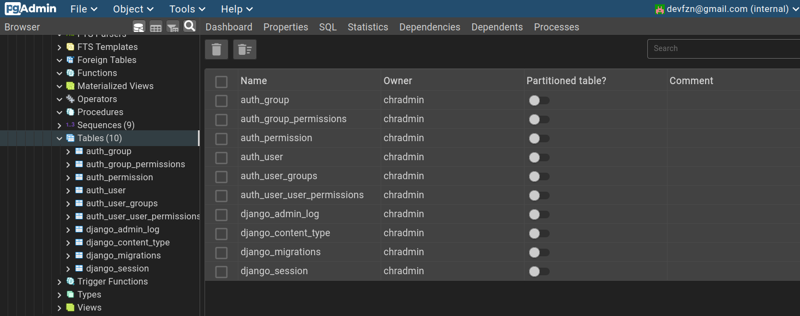
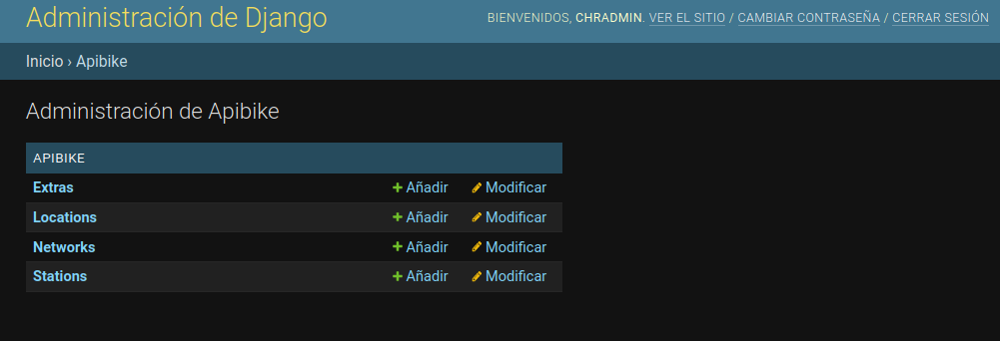
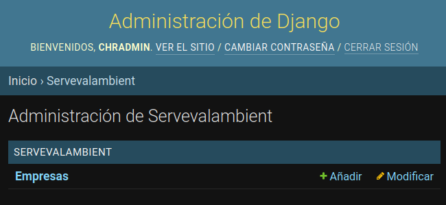

# Test practico CHR

#### Tecnologias requeridas

- Django4
- GitHub
- PostgreSQL

### Primera tarea - Consulta API

Bike Santiago [API](http://api.citybik.es/v2/networks/bikesantiago)

- Función para obtener información de la API *(requests, urllib3 o aiohttp)*.
- Creación de modelo.
- Guardar en modelo.

Opcionales:

- Generar vista en el administrador de estos datos.
- Utilizar Bootstrap 5

### Segunda tarea - WebScraping

Crear script para obtener información de tabla en
[URL](https://seia.sea.gob.cl/busqueda/buscarProyectoAction.php) de Servicio de
Evaluación Ambiental *(BS4 o Sellenium)*. Este debe:

- Recorrer todas las páginas y obtener la información de las tablas.
- Crear archivo **.json** con la información obtenida.
- Crear modelo para guardar la información.

Opcionales:

- Generar vista en el administrador de estos datos.
- Utilizar Bootstrap 5


## Proyecto

> **Importante** en `./chr_website/chr_test/settings.py` se exponen datos
> confidenciales que no deberían estar allí, como esta aplicación es realizada
> con fines didácticos se omite el uso de **variables de entorno** o archivo
> de configuración sin seguimiento. Esto aplica además para la `SECRET_KEY` de
> Django. Además de mantener el estado `DEBUG = True`. Ambos deben se parte de
> un archivo de configuración diferente, como por ej. `production.py`.

Dependencias

- PostgreSQL >= v15.1(instalar, iniciar, crear usuario y base de datos)
- Python >= 3.10.9
- PgAdmin4 (opc. y en entorno virtual)

<!--  -->

Instalar requerimientos (usar entorno virtual)

```py
pip install -r requirements.txt
```

### Detalle

Crear proyecto `django-admin startproject chr_test`, cambiar al directorio del
proyecto y probar la instalación `python manage.py runserver`.

Crear migraciones y migrar cuando se realizen cambios que modifican la base de datos:

- `python manage.py makemigrations`
- `python manage.py migrate`

Creación de super usuario:

- `python manage.py createsuperuser chradmin`.

Creación de dos django apps:

- `python manage.py startapp apiBike`
- `python manage.py startapp servEvalAmbient`

Agregar apps en [./chr_website/chr_test/settings.py](./chr_website/chr_test/settings.py)

Creación de modelos de las apps:

- [../apiBike/models.py](./chr_website/apiBike/models.py)
- [../servEvalAmbient/models.py](./chr_website/servEvalAmbient/models.py)

Creación de las vistas:

- [../apiBike/views.py](./chr_website/apiBike/views.py)
- [../servEvalAmbient/views.py](./chr_website/servEvalAmbient/views.py)

Creación de urls para las vistas:

- [../apiBike/urls.py](./chr_website/apiBike/urls.py)
- [../servEvalAmbient/urls.py](./chr_website/servEvalAmbient/urls.py)

Agregar Urls al proyecto en [./chr_website/chr_test/urls.py](./chr_website/chr_test/urls.py)

Correr el proyecto `python manage.py runserver`

Urls routes creadas:

- `http://127.0.0.1:8000/apiBike/`
- `http://127.0.0.1:8000/servAmbiente/`
- `http://127.0.0.1:8000/admin/` (por defecto)

> Nota: no se crea un "home" o "landing" por lo tanto visitar `http://127.0.0.1/`
> devuelve error `404` como respuesta.

Añadir modelos al panel de administración:

- [../apiBike/admin.py](./chr_website/apiBike/admin.py)



- [../servEvalAmbient/admin.py](./chr_website/servEvalAmbient/admin.py)



Mas imagenes del administrador en [imgs/](./imgs)
